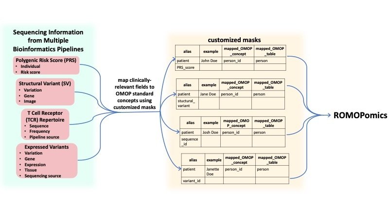

# OMICS to OMOP
Convert MultiOmics data into formats compatible with OMOP CDM 

## Contributors 

- Nicholas Giangreco - Lead 
- Meghana Tandon 
- Kamileh Narsinh 
- Sal Volpe 

## Background 

Clinical applications of sequencing and -omics data remain an underutilized resource for patient care in the push for precision medicine. Clinicians can learn valuable patient-specific information from sequencing data, including PRSs (polygenic risk scores), SVs (structural variants), SNPs, TCR repertoire profiling, etc. Unfortunately, this crucial information is often buried in -omics databases that are impractical for clinical use. Furthermore, the multitude of biological silos housing this data do not conform to the same naming conventions, formatting, etc. Standardization is overall lacking. Bioinformaticians, clinical informaticists, computational biologists, and other stakeholders aim to provide clinicians with diagnostically relevant genetic information in a manner that is interpretable and useful at the point of care. To do this, we map select OMICs data to the Observational Medical Outcomes Partnership Common Data Model [(OMOP CDM)](https://github.com/collaborativebioinformatics/PRS_reporting) to enforce standardization, and facilitate clinical decision support. 

## Goal 

To transform the genomic data output of several bioinformatics pipelines... 

- PRS: [PRS_reporting repo](https://github.com/collaborativebioinformatics/PRS_reporting)  
- SV: [Clinical SVs repo](https://github.com/collaborativebioinformatics/clinical_SVs)  
- TCR: [TCR repo](https://github.com/collaborativebioinformatics/TCRs_to_clinic)  
- Expression and SNPs: [Clinically Expression & SNPs repo](https://github.com/collaborativebioinformatics/expression_and_SNPs_to_clinic)  

...into a format compatible with the ROMOPOmics package (https://github.com/ngiangre/ROMOPOmics), which further standardizes the data according the [OMOP CDM] (https://www.ohdsi.org/data-standardization/the-common-data-model/) specifications. This project thus extends the existing OMOP CDM to accommodate genomic information. 

## Methodology Flowchart 

## Installation

    devtools::install_github("collaborativebioinformatics/omics_to_omop",force=T) 

## Implementation

#### Inputs 

Note that there are many potentially clinically relevant fields available from these bioinformatics pipelines. Only a few are currently implemented for demonstration purposes.  

- PRS:
    - Disease
    - PRS Score
    - Disease Log Odds Ratio                  
- SV 
    - Gene
    - Variant
    - Start
    - End
    - Variant Type
    - Size    
- TCR
    - V segment expressed
    - Junction amino acid
    - number of times TCR gene expressed  
- Expressed Variants & Annotations
    - Patient
    - Tissue source
    - SRA run  

#### Output

- One SQLite database per input that maps input fields to the OMOP CDM
