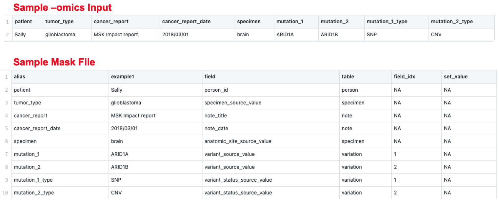

# OMICS to OMOP
Convert Multi-omics data into formats compatible with OMOP CDM, making it accessible in Electronic Health Records (EHRs)

## Contributors 

- Nicholas Giangreco - Lead 
- Meghana Tandon 
- Kamileh Narsinh 
- Sal Volpe 


## Background 

Clinical applications of sequencing and -omics data remain an underutilized resource for patient care in the push for precision medicine. Clinicians can learn valuable patient-specific information from sequencing data, including PRSs (polygenic risk scores), SVs (structural variants), SNPs, TCR repertoire profiling, etc. Unfortunately, this crucial information is often buried in -omics databases that are impractical for clinical use. Furthermore, the multitude of biological silos housing this data do not conform to the same naming conventions, formatting, etc. Standardization is overall lacking. Bioinformaticians, clinical informaticists, computational biologists, and other stakeholders aim to provide clinicians with diagnostically relevant genetic information in a manner that is interpretable and useful at the point of care. To do this, we map select OMICs data to the Observational Medical Outcomes Partnership Common Data Model [(OMOP CDM)](https://www.ohdsi.org/data-standardization/the-common-data-model) to enforce standardization, and facilitate clinical decision support. 

## Goal 

To transform the genomic data output of several bioinformatics pipelines... 

- PRS: [PRS_reporting repo](https://github.com/collaborativebioinformatics/PRS_reporting)  
- SV: [Clinical SVs repo](https://github.com/collaborativebioinformatics/clinical_SVs)  
- TCR: [TCR repo](https://github.com/collaborativebioinformatics/TCRs_to_clinic)  
- Expression and SNPs: [Clinically Expression & SNPs repo](https://github.com/collaborativebioinformatics/expression_and_SNPs_to_clinic)  

...into a format compatible with the ROMOPOmics package (https://github.com/ngiangre/ROMOPOmics), which further standardizes the data according the [OMOP CDM](https://www.ohdsi.org/data-standardization/the-common-data-model/) specifications. This project thus extends the existing OMOP CDM to accommodate genomic information. 


## Methodology Flowchart


The output of the bioinformatics pipelines is in either .tsv or .csv format, and is populated with fields/columns with -omics data that are 
Currently, a mask is a .csv that has the fields/columns from the original bioinformatics pipelines, such as patient identifier, tissue source, gene, variant, etc. We manually construct a mask file, also a .tsv or .csv, containing the aforementioned genomic information, and their corresponding concepts/fields in OMOP CDM's Standardized Vocabulary, along with their [Data type](https://ohdsi.github.io/CommonDataModel/dataModelConventions.html).
We take the outputs from the bioinformatics pipelines and develop custom masks for each unique pipeline. This maintains the privacy of patient data in accordance with [HIPAA](https://en.wikipedia.org/wiki/Health_Insurance_Portability_and_Accountability_Act). Future goals include automating the process of masking such that a custom mask does not have to be developed for each bioinformatics pipeline. 

### Converting the -omics data using the mask

Future updates should consider automating this step



### [ROMOPomics](https://github.com/AndrewC160/ROMOPOmics)

This package to transform the masked data into tables that adhere to the OMOP CDM, which contains all the fields and tables necessary for standardization, shareability, and interoperability.

## Installation

    devtools::install_github("collaborativebioinformatics/omics_to_omop",force=T) 

## Implementation

### Inputs 

Note that there are many potentially clinically relevant fields available from these bioinformatics pipelines. Only a few are currently implemented for demonstration purposes.  

- PRS:
    - Disease
    - PRS Score
    - Disease Log Odds Ratio                  
- SV 
    - Gene
    - Variant
    - Start
    - End
    - Variant Type
    - Size    
- TCR
    - V segment expressed
    - Junction amino acid
    - number of times TCR gene expressed  
- Expressed Variants & Annotations
    - Patient
    - Tissue source
    - SRA run  

AND

- 1 custom mask file per each bioinformatics pipeline that maps the -omics data to fields in the OMOP CDM

### Output

- One SQLite database per input whose data is now OMOP CDM-compliant. The resulting standardized data tables are now interoperable, and are available for sharing across multiple platforms, including EHR/EMR systems. 

## Demonstration

see also src/R/team_data.R

```
#install.packages("devtools")
devtools::install_github("ngiangre/ROMOPOmics",force=T)

library(ROMOPOmics)
library(tidyverse)

dm_file <- 
    system.file("extdata","OMOP_CDM_v6_0_custom.csv",package="ROMOPOmics",mustWork = TRUE)
dm <- 
    loadDataModel(master_table_file = dm_file)

omop_inputs <- 
    list(
        mock_patient =
            readInputFile(
                input_file = "data/mock_patient.csv",
                data_model = dm,
                mask_table = loadModelMasks("data/mock_patient_mask.csv"),
                transpose_input_table = T
            ),
        team3 =
            readInputFile(
                input_file = "data/team3/NA19461.clinicalsv.csv",
                data_model = dm,
                mask_table = loadModelMasks("data/team3/NA19461.clinicalsv_mask.csv"),
                transpose_input_table = T
            ),
        team4 =
            readInputFile(
                input_file = "data/team4/AR1-T_S4_results_subset.csv",
                data_model = dm,
                mask_table = loadModelMasks("data/team4/AR1-T_S4_results_mask.csv"),
                transpose_input_table = T
            ),
        team5 =
            readInputFile(
                input_file = "data/team5/GSE75935_SRA_Run_Table_Clean_Human.csv",
                data_model = dm,
                mask_table = loadModelMasks("data/team5/GSE75935_SRA_Run_Table_Clean_Human_mask.csv"),
                transpose_input_table = T
            )
    )
db_inputs   <- combineInputTables(input_table_list = omop_inputs)
for(i in seq_along(db_inputs)){
    name_ <- names(db_inputs)[i]
    db_inputs[[i]] %>% 
        write_csv(paste0("data/omop_omics/",name_,".csv"))
}
omop_db     <- buildSQLDBR(omop_tables = db_inputs,file.path("data","omop_omics.sqlite"))
DBI::dbListTables(omop_db)
DBI::dbDisconnect(omop_db)
```
## Resources

OHDSI/OMOP CDM: (https://www.ohdsi.org/data-standardization/the-common-data-model/)  

ROMOPomics package: (https://github.com/AndrewC160/ROMOPOmics)
